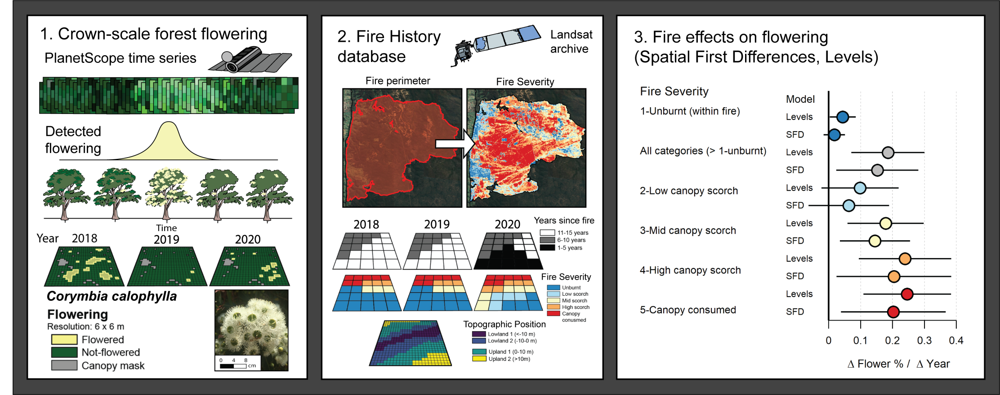

Overview
--------

This repository is associated with the [open access paper](https://www.sciencedirect.com/science/article/pii/S0048969723034514, "Fire effects on eucalypt flowering")
 "Fire reduces eucalypt forest flowering phenology at the landscape-scale" in the journal *Science of the Total Environmnet* by Dan Dixon, Nik Callow, John Duncan, Sam Setterfield, and Natasha Paul (2023). 

  

Included are the following data:
--------

  - Gridded flowering rasters for 2018, 2019 and 2020
  - Perimeters and rasters of fires used in this study
  - CSV file containing proportional flowering of treatment and control pairs
 
Analysis
--------
   -  Flower detection via Google Earth Engine (xxx.ipynb)
   -  Sample treatment and control pairs
   -  R code to run SFD/Levels model

Cite
--------

Questions
--------
Dan J. Dixon

Email: 1dandixon@gmail.com
Cooperative Research Centre for Honeybee Products: https://www.crchoneybeeproducts.com/
